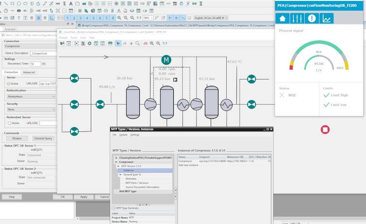

# Revolutionize Your Modular Automation with the WinCC OA MTP Importer!
**Transform your MTP (Module Type Package) effortlessly into a fully functional WinCC OA configuration —without the hassle of manual work. The importer automatically creates the project structure, configures connections, and generates visualizations, reducing integration time from hours/days to minutes.**

## Overview
**The MTP Importer** reads the MTP file and automatically creates the WinCC OA configuration: data points, OPC UA connections, and visualization panels.

## Key Features
### Automatic data point generation
Create datapoint types and datapoints with all necessary configurations based on the MTP structure.

### Out-of-the-Box OPC UA Integration
Eliminate the manual configuration of communication interfaces. The MTP Importer automatically sets up the required OPC UA client connections to ensure seamless data communication between your WinCC OA system and the modular units. This significantly reduces the effort for connectivity and enables a quick start.

### Panels generation
Generate ready to use HMI panels. These visualizations provide you with immediate overview and control over your modular units, without the need to manually draw or link each element.

### Contextual MTP Understanding
The importer comprehends the hierarchical structure and semantics of your MTP files. It automatically recognizes modules, interfaces, and parameters, enabling precise and error-free transfer into the WinCC OA environment and facilitating adaptation to changes.

For detailed instructions on usage and integration, please refer to the datasheet with the name: **WinCCOAMTPExample.pdf.”**

## Conclusion
**MTP Importer** offers you a fast, efficient, and error-free path from module description to a fully operational SCADA system. Less effort, higher quality, and drastically reduced time-to-market